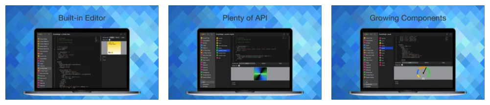
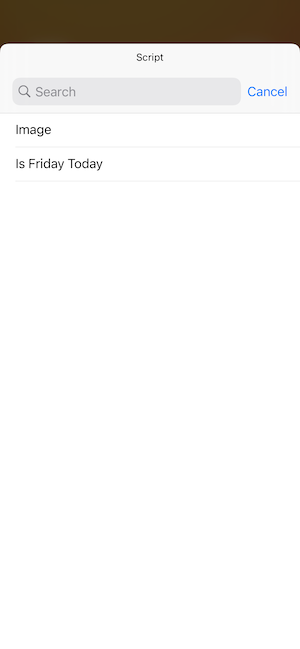
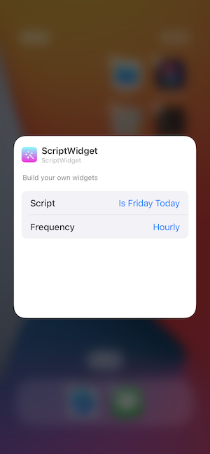
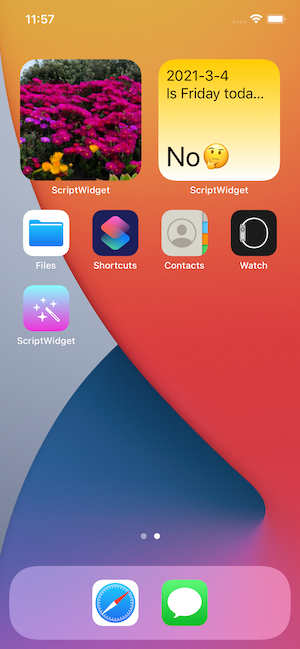

## Introduction

ScriptWidget is an iOS and macOS app that we can create widgets for iOS and macOS using JSX label style in JavaScript.

## Screenshots

## Download

iOS / macOS

- us https://apps.apple.com/us/app/scriptwidget/id1555600758
- cn https://apps.apple.com/cn/app/scriptwidget/id1555600758

## Quick start

### Create script

Tap top-right plus button to `Create from templates`:

For example, choose `Is Friday Today`, then tap `Create` button at top-right.

### Add widget

1. Long press desktop, then follow steps below.
2. Find `ScriptWidget` and tap.
3. Choose widget size
4. Tap widget when `No script selected` and select a script
5. You can also select script update frequency.
6. Then widget is ready.

## Develop widget

For how to develop widget. ref: [Develop widget](/docs/develop)

## iCloud

If iCloud is ready, you could find script in `Files` app : `ScriptWidget` folder.

## Group

Welcome to join [Group](/docs/group)

## Enjoy coding

:)